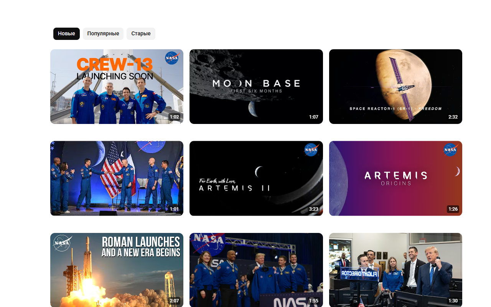

# 6-Column Grid

Six thumbnails per row instead of three — in the video grid feed.

> ⚠️ **Not affiliated with, endorsed by, or sponsored by YouTube or Google.**
> Independent, unofficial browser extension. It only sets a CSS variable to change the grid layout: it does not modify site code, does not block ads, does not download videos, and makes no network requests. Product names and trademarks belong to their respective owners.

**[English](#english) · [Русский](#russian)**

<a id="english"></a>
## English

### What it is

A tiny Manifest V3 extension that shows **6 videos per row** instead of the default 3. It does not rewrite the DOM — it overrides a single CSS variable that the site's own layout engine already uses, so the native grid math does the rest (no performance cost).

### Screenshots

| Before (3 per row) | After (6 per row) |
|---|---|
|  |  |

### Features

| Feature | What it does |
|---|---|
| 🔢 6 per row | Sets `--ytd-rich-grid-items-per-row: 6` (and the mini variant) on the grid renderer |
| ⚡ Native layout math | No DOM rewriting, no observers, no timers — the site's own CSS does the work |
| 🔘 On/off toggle | Toolbar popup switch, persisted locally |
| 🔒 Zero network | The extension never sends a single request anywhere |
| 🪶 Tiny | A few kilobytes, no dependencies, no build step |

### How it works

The site sizes grid items with its own formula:

```css
width: calc(100% / var(--ytd-rich-grid-items-per-row) - var(--ytd-rich-grid-item-margin));
```

The extension adds a class to `<html>` and overrides that variable:

```css
html.six-column-grid ytd-rich-grid-renderer {
  --ytd-rich-grid-items-per-row: 6 !important;
  --ytd-rich-grid-mini-per-row: 6 !important;
}
```

$$\text{item width} = \frac{100\%}{6} - \text{margin}$$

### Install (unpacked)

1. Download `6-column-grid-1.0.0.zip` from [Releases](../../releases/latest) and unpack it anywhere.
2. Open `brave://extensions`, `chrome://extensions` or `edge://extensions` → enable **Developer mode** → **Load unpacked** → select the unpacked folder.
3. Open the video site — you should now see 6 thumbnails per row. If the tab was already open, reload it.

Turn it on/off with the toolbar icon.

### Privacy

- No data collection, no telemetry, no analytics.
- **No network requests at all.**
- The single `storage` permission is used only to remember the on/off state.
- No remote code, no eval.

### FAQ

<details>
<summary><b>Nothing changed after installing — why?</b></summary>

Reload the tab: content scripts do not run on pages that were open before the extension was installed or updated.
</details>

<details>
<summary><b>Can I choose 4 or 5 per row?</b></summary>

Not in this version — the value is fixed at 6. You can change it in `content.css` (`--ytd-rich-grid-items-per-row`) if you load the extension unpacked.
</details>

<details>
<summary><b>Does it work everywhere on the site?</b></summary>

It affects grid layouts that use the rich-grid variable: home feed, subscriptions and channel “Videos” pages. Search results and short-video shelves use different layouts and are not affected.
</details>

### Known limitations

<details>
<summary><b>Things to know</b></summary>

- If the site changes its markup or variable names, the override may stop working until the extension is updated.
- No per-site or per-page settings; a single global on/off switch.
- Ad slots and promo blocks inside the grid are not modified.
</details>

### Development

No build step, no dependencies.

```
manifest.json   MV3 manifest
content.js      adds/removes the class, listens for toggle changes
content.css     the CSS variable override
popup.html/js   on/off switch (chrome.storage)
```

### License

MIT — see [LICENSE](LICENSE).

[↑ Back to top](#6-column-grid)

<a id="russian"></a>
## Русский

> ⚠️ **Не связано с YouTube или Google.** Независимое неофициальное расширение; названия и товарные знаки принадлежат их владельцам.

### Что это

Крошечное расширение (Manifest V3), которое показывает **6 видео в ряду** вместо стандартных 3. Оно не переписывает DOM, а подменяет одну CSS-переменную, которой пользуется сама вёрстка сайта — дальше встроенная математика раскладки справляется сама (без потери производительности).

### Скриншоты

| Было (3 в ряду) | Стало (6 в ряду) |
|---|---|
|  |  |

### Возможности

| Возможность | Что делает |
|---|---|
| 🔢 6 в ряду | Задаёт `--ytd-rich-grid-items-per-row: 6` (и мини-вариант) для сетки |
| ⚡ Родная раскладка | Никаких переписываний DOM, наблюдателей и таймеров — работает CSS сайта |
| 🔘 Переключатель | Вкл/выкл в popup, состояние хранится локально |
| 🔒 Ноль сети | Расширение не отправляет ни одного запроса |
| 🪶 Крошечное | Несколько килобайт, без зависимостей и сборки |

### Как это работает

Сайт считает ширину элемента сетки своей формулой:

```css
width: calc(100% / var(--ytd-rich-grid-items-per-row) - var(--ytd-rich-grid-item-margin));
```

Расширение добавляет класс на `<html>` и переопределяет переменную:

```css
html.six-column-grid ytd-rich-grid-renderer {
  --ytd-rich-grid-items-per-row: 6 !important;
  --ytd-rich-grid-mini-per-row: 6 !important;
}
```

$$\text{ширина элемента} = \frac{100\%}{6} - \text{отступ}$$

### Установка (распакованное расширение)

1. Скачайте `6-column-grid-1.0.0.zip` со страницы [Releases](../../releases/latest) и распакуйте.
2. Откройте `brave://extensions`, `chrome://extensions` или `edge://extensions` → включите **Режим разработчика** → **Загрузить распакованное расширение** → выберите папку.
3. Откройте сайт — в ряду должно стать 6 превью. Если вкладка была открыта раньше — перезагрузите её.

Включить и выключить можно кнопкой на панели инструментов.

### Приватность

- Данные не собираются, телеметрии и аналитики нет.
- **Сетевых запросов нет вообще.**
- Единственное разрешение `storage` — только для хранения состояния вкл/выкл.
- Удалённого кода и eval нет.

### FAQ

<details>
<summary><b>После установки ничего не изменилось — почему?</b></summary>

Перезагрузите вкладку: content-скрипты не срабатывают на страницах, открытых до установки или обновления расширения.
</details>

<details>
<summary><b>Можно сделать 4 или 5 в ряду?</b></summary>

В этой версии нет — значение фиксировано на 6. Его можно поменять в `content.css` (`--ytd-rich-grid-items-per-row`), если загружать расширение распакованным.
</details>

<details>
<summary><b>Работает ли везде на сайте?</b></summary>

Действует на сетках, которые используют переменную rich-grid: главная, подписки и вкладка «Видео» на каналах. Поиск и полки с Shorts устроены иначе и не затрагиваются.
</details>

### Известные ограничения

<details>
<summary><b>Что стоит знать</b></summary>

- Если сайт сменит разметку или имена переменных, подмена перестанет работать до обновления расширения.
- Настроек по сайтам и страницам нет — один глобальный переключатель вкл/выкл.
- Рекламные и промо-блоки внутри сетки не изменяются.
</details>

### Разработка

Без сборки и зависимостей.

```
manifest.json   манифест MV3
content.js      добавляет и убирает класс, следит за переключением
content.css     переопределение CSS-переменной
popup.html/js   переключатель вкл/выкл (chrome.storage)
```

### Лицензия

MIT — см. [LICENSE](LICENSE).

[↑ Наверх](#6-column-grid)
