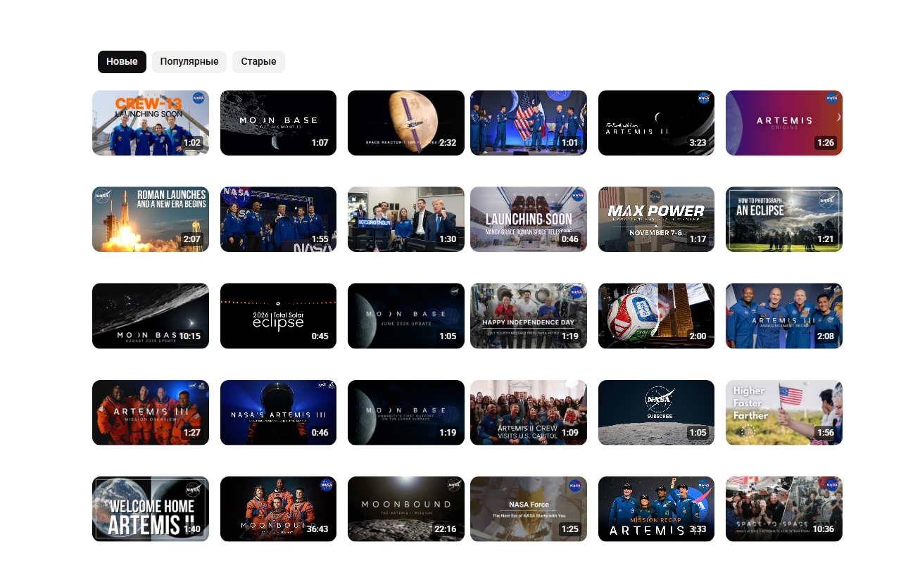

**English** | [Русский](#russian)

<a id="english"></a>

# 6-Column Grid

> **Not affiliated with, endorsed by, or sponsored by YouTube or Google.**
> Independent, unofficial browser extension. It only sets a CSS variable to change the grid layout: it does not modify site code, does not block ads, does not download videos, and makes no network requests.

Browser extension (Brave / Chromium, Manifest V3) that shows **6 videos per row** instead of the default 3 in the video grid feed.

## Preview

| Before (3 per row) | After (6 per row) |
| --- | --- |
|  |  |

## Install from a ZIP (no cloning needed)

1. Download `6-column-grid-v1.0.0.zip` from [Releases](../../releases/latest).
2. **Extract** the ZIP anywhere, e.g. to your Desktop.
3. Open `brave://extensions` (Brave), `chrome://extensions` (Chrome, Chromium, Edge, Vivaldi, Opera).
4. Turn on **Developer mode** (top-right toggle).
5. Click **Load unpacked**, then select the extracted `6-Column Grid` folder.
6. Open the video site — you should now see 6 thumbnails per row.

Turn it on/off with the extension's toolbar icon.

## Install for developers

```bash
git clone https://github.com/lECL1PS3l/6-column-grid.git
```

Then steps 3–6 above, pointing at the cloned folder.

## How it works

YouTube sizes grid items with `width: calc(100%/var(--ytd-rich-grid-items-per-row) - var(--ytd-rich-grid-item-margin))`. The extension overrides that CSS variable to `6`, so the native layout math does the rest — no DOM rewriting, no perf cost.

## Files

| File | Purpose |
| --- | --- |
| `manifest.json` | MV3 manifest |
| `content.js` | Adds/removes the `yt-rows-6` class, listens for toggle changes |
| `content.css` | The CSS variable override |
| `popup.html` / `popup.js` | On/off switch, persisted in `chrome.storage.local` |

## License

MIT — see [LICENSE](LICENSE).

---
<a id="russian"></a>

[English](#english) | **Русский**

# 6-Column Grid

> **Не связано с YouTube или Google, не одобрено и не спонсируется ими.**
> Независимое неофициальное расширение. Оно только задаёт CSS-переменную раскладки: код сайта не изменяется, реклама не блокируется, видео не скачиваются, сетевых запросов нет.

Расширение для браузера (Brave / Chromium, Manifest V3), которое показывает **6 видео в ряду** вместо стандартных 3.

## Превью

| Было (3 в ряду) | Стало (6 в ряду) |
| --- | --- |
|  |  |

## Установка из ZIP (не нужно клонировать репозиторий)

1. Скачайте `6-column-grid-v1.0.0.zip` со страницы [Releases](../../releases/latest).
2. **Распакуйте** архив в любое место, например на рабочий стол.
3. Откройте `brave://extensions` (Brave), `chrome://extensions` (Chrome, Chromium, Edge, Vivaldi, Opera).
4. Включите **Режим разработчика** (переключатель справа сверху).
5. Нажмите **Загрузить распакованное расширение** и выберите распакованную папку `6-Column Grid`.
6. Откройте видео-сайт — теперь в ряду должно быть 6 превью.

Включить и выключить расширение можно кнопкой на панели инструментов.

## Установка для разработчиков

```bash
git clone https://github.com/lECL1PS3l/6-column-grid.git
```

Дальше выполните шаги 3–6 выше, указав папку с клонированным репозиторием.

## Как это работает

YouTube задаёт размер элементов сетки через `width: calc(100%/var(--ytd-rich-grid-items-per-row) - var(--ytd-rich-grid-item-margin))`. Расширение подменяет эту CSS-переменную на `6`, а дальше встроенная логика раскладки справляется сама — без переписывания DOM и без потери производительности.

## Файлы

| Файл | Назначение |
| --- | --- |
| `manifest.json` | Манифест MV3 |
| `content.js` | Добавляет и убирает класс `yt-rows-6`, следит за переключением |
| `content.css` | Переопределение CSS-переменной |
| `popup.html` / `popup.js` | Переключатель вкл/выкл, состояние хранится в `chrome.storage.local` |

## Лицензия

MIT — см. [LICENSE](LICENSE).